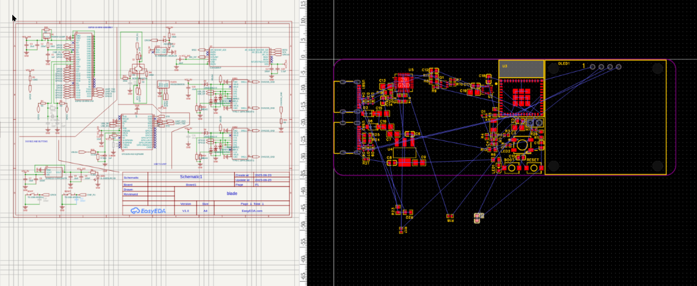

title: "blade"
author: "TheTridentGuy"
description: "Gravity knife inspired ESP32 devboard"
### June 26:
4h
Been working on this all day, and now seems like a good time to journal.
Somehow I fucked up and sent my USB port wiring to the shadow realm, so now it's a recovery operation, fuck easyeda.

### June 24-25:
12h (~6h each day)

I kinda got carried away with this project and spent a ton of time on it without journaling, but here's my progress so far:

I spent most of June 24 recreating the ESP32-C6-MINI devkit, with some changes. I also started working in an IMU and display.Today has been mostly component layout and minor changes where necessary. I originally tried using a prebuilt microcontroller module, but sttled on a custom one to save space and adapt to my needs more. Imma go finish layout now, baiii~